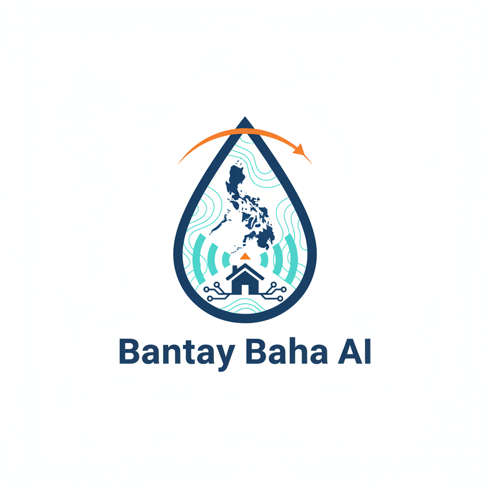

# Bantay Baha AI MVP (Django)

Minimal hackathon MVP for:
- 1-6 hour flood risk estimation
- nearest evacuation center lookup
- safer routing around flood-prone zones
- rule-based chat endpoint that orchestrates all key tools and can answer flood Q&A
- local-language interaction for residents and responders (English + Tagalog/Visayan intent handling)
- OpenAI API-backed chat responses using structured tool outputs

The assistant can:
- project and explain flood levels
- lookup nearest evacuation center
- provide safe routing to an evacuation center
- summarize relevant contextual metadata (hazard score, nearest center, routing status, and confidence)

Demo mode is included to run repeatable typhoon scenarios for quick testing without live weather dependency.

## Quickstart

```bash
python -m venv .venv
source .venv/bin/activate
pip install -r requirements.txt
python manage.py migrate
python manage.py runserver
```

### Generate Negros Data (required for accurate area/risk maps)

The following files are stored locally and excluded from git by `.gitignore`:

- `data/negros_graph.graphml`
- `data/negros_rivers.geojson`
- `data/river_sample_points.json`
- `data/negros_river_graph.gpickle`

Run once (or whenever files are deleted):

```bash
source .venv/bin/activate
python scripts/load_negros_roads.py
python scripts/build_river_graph.py
```

Open `http://127.0.0.1:8000/`.

## API Endpoints

- `GET /api/risk/?lat=14.60&lng=121.00&hours=3`
- `GET /api/evac-centers/?lat=14.60&lng=121.00`
- `GET /api/safe-route/?origin_lat=14.60&origin_lng=121.00&dest_lat=14.64&dest_lng=121.09&mode=safe`
- `POST /api/chat/` with JSON body `{ "message": "risk and evac" }`

### Demo weather mode

`/api/risk/`, `/api/safe-route/`, and chat flows support demo typhoon scenarios by adding:

- `weather_mode=demo`
- `demo_rainfall` as a comma list or JSON array
- `demo_upstream_rainfall` as a JSON array for per-node overrides in demo mode (optional)

Examples:

```bash
curl "http://127.0.0.1:8000/api/risk/?lat=14.60&lng=121.00&hours=6&weather_mode=demo&demo_rainfall=80,90,75,40,10,0"
curl "http://127.0.0.1:8000/api/risk/?lat=14.60&lng=121.00&hours=3&weather_mode=demo&demo_rainfall=[12,14,16]"
```

Safe-route demo example:

```bash
curl "http://127.0.0.1:8000/api/safe-route/?origin_lat=14.60&origin_lng=121.00&dest_lat=14.64&dest_lng=121.09&hours=4&mode=safest&weather_mode=demo&demo_rainfall=80,90,75,40,10,0"

curl "http://127.0.0.1:8000/api/risk/?lat=14.60&lng=121.00&hours=6&weather_mode=demo&demo_rainfall=80,90,75,40,10,0&demo_upstream_rainfall=[{\"lat\":14.6001,\"lng\":121.0002,\"demo_rainfall\":[50,40,30]}]"
```

Live mode (default) remains unchanged:

```bash
curl "http://127.0.0.1:8000/api/risk/?lat=14.60&lng=121.00&hours=3"
```

In the chat UI, open Settings → enable Demo Mode, then enter values like `10,22,45,30,12,5`. The selected mode is sent in the `/api/chat/` payload:

```json
{
  "message": "check risk",
  "lat": 14.60,
  "lng": 121.00,
  "weather_mode": "demo",
  "demo_rainfall": [10, 22, 45, 30, 12, 5],
  "demo_upstream_rainfall": [{"lat":14.6001,"lng":121.0002,"demo_rainfall":[50,40,30]}]
}
```
